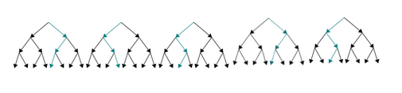

# P10_decision
## Arbre de décision, Forêt aléatoire

### Principe du l'arbre de décision

Un arbre de décision modélise une hiérarchie de tests pour prédire un résultat. 
Il existe deux principaux types d’arbre de décision : l'arbre de régression ou l'arbre de classifiction. 
Ici, nous traitons un problème de régression, c'est donc le premier qui sera utilisé. Il permet de prédire une quantité réelle, une valeur numérique : par exemple, le prix d’une maison, comme c'est le cas ici.

Les décisions possibles sont situées aux extrémités des branches (les « feuilles » de l’arbre) et sont atteintes en fonction de décisions prises à chaque étape. 
Un arbre de décision fonctionne en appliquant de manière itérative des règles logiques très simples, chaque règle étant choisie en fonction du résultat de la règle précédente. 
Les arbres de décision ont pour avantage d’être simple à interpréter, très rapide à entrainer, d’être non paramétrique, et de nécessiter très peu de prétraitement des données.

### Random Forest

Un autre usage en machine learning consiste à construire non pas un arbre mais une forêt d’arbres de décision. 
Une décision est alors prise en faisant « voter » l’ensemble des arbres et en choisissant la réponse majoritaire (pour un choix discret) ou la moyenne des réponses (pour une variable continue). 

L’algorithme des « forêts aléatoires » (ou Random Forest parfois aussi traduit par forêt d’arbres décisionnels) est un algorithme de classification qui réduit la variance des prévisions d’un arbre de décision seul, améliorant ainsi leurs performances.
Cet algorithme effectue un apprentissage en parallèle sur de multiples arbres de décision construits aléatoirement et entraînés sur des sous-ensembles de données différents. 

Le nombre idéal d’arbres est un paramètre important : il est très variable et dépend du problème. 
Concrètement, chaque arbre de la forêt aléatoire est entrainé sur un sous ensemble aléatoire de features  selon le principe des « projections aléatoires ». Les prédictions sont ensuite moyennées (lorsque les données sont quantitatives) ou utilisés pour un "vote" (pour des données qualitatives, dans le cas des arbres de classification). 
L’algorithme des forêts aléatoires est connu pour être un des classifieurs les plus efficaces parmis ceux qui nécessitent peu de prétraitement des données. 

## Etude du dataset "California Housing"

### Analyse des données

_Histogrammes_

La visualisation des histogrammes montre que :
* __Longitude__ : Distribution bimodale. La répartition Est-ouest des maisons montre deux pics d'intensité autour de 122°W et 118°W, avec une densité nettement moins importante entre les deux, autour de 120°W. Géographiquement, ces zones où les maisons sont plus nombreuses (donc, on peut le supposer, plus fortement peuplées) correspondent en effet à la côte pacifique (~122°W), avec les baies de Los Angeles et San Francisco, et aux vallées de Sacramento et de San Joaquim (~118°w). Entre ces deux zones s'élève les montagnes côtières (coast range) et à l'ouest la chaîne de montagne qui borde le désert (sierra range).
* __Latitude__ : de la mème façon, il y a deux pics de densité autour de 34°N et 38°N (distribution bimodale), soit aux niveau de San Francisco-Sacramento, et Los Angeles plus au sud.
* __Âge moyen__ des maisons : Réparti de 0 (maisons neuves) à 52 ans environ. Nombre important de maisons ayant entre 15 et 40 ans, mais sans linéarité dans la progression. Peu de maisons neuves. Pic à 52 ans : il serait nécessaire de se documenter pour voir s'il y a une raison à cela ou s'il s'agit d'outliers.
* __nombre total de pièces__ dans un bloc, __nombre total de chambres__, __population__ et __nombre de foyers__ : on toutes des distributions asymétriques, courbes obliques à gauche.
* __Revenu moyen__ des foyers au sein d'un bloc : Etalé entre 0.5 et 15 (tens of thousands of US Dollars) la médiane se situant autour de 3.5. Distribution asymétrique mais plus répartie que les précédentes.
* __Valeur moyenne des maisons__ (target) : asymetrique oblique a gauche, de 20k$ à 50k$ avec une médiane à 180k$. Dispersion plus étalée que les précédentes. Remontée brutale à 50k$ : outliers ?

_Cartes_

Ces cartes corrèlent les hypothèses faites d'après les histogrammes au niveau de la latitude et de la longitude.

Le croisement des données nous donne également une nouvelle information : on voir dès la première carte que le prix des maisons augmente avec la proximité géographique de l'océan et des baies de San-Francisco et Los Angeles (et pas de manière franche aux abords de Sacramento).

Les deux dernières cartes nous montre que d'autres données (ici population et revenus moyens du foyer) évoluent également en lien avec la relation entre la localisation et le prix des maisons.

## Prédiction du prix des maisons

Nous avons testé 3 modèles de régression pour réaliser ces prédictions : la régression linéaire, l'arbre de décision, et la forêt aléatoire.

Le meilleur modèle est le dernier qui a été testé, à savoir le Random Forest Regresor (forêt aléatoire), à condition qu'il soit initialisés avec les bons paramètres. L'utilisation de la méthode d’optimisation GridSearch nous a permis d'évaluer différentes associations de paramètres et d'en comparer les performances pour déduire le meilleur paramétrage.

En effet, lorsque l'on implémente un modèle de Random Forest, on doit choisir le nombre d’arbres à créer et le nombre de variables à utiliser à chaque division d’un noeud. La méthode GridSearch utilise la validation croisée (cross-validation) pour construire autant de modèles que nécessaire et évaluer leur performance les uns par rapport aux autres.

La méthode Grid Search a néanmoins ses limites puisque les paramètres à tester doivent être définis à l'avance et manuellement. De fait, on a déterminé que la performance était meilleure avec 30 arbres qu'avec 3 ou 10. Mais on aurait peut-être un meilleur résultat avec 25 ou 35 arbres...
Par contre un avantages important de cette méthode est que les traitements ne dépendent pas les uns des autres et peuvent être donc parallélisés.

     

sources :
_Leo Breiman. Random forests. Machine Learning, 45(1):5–32, 2001_

